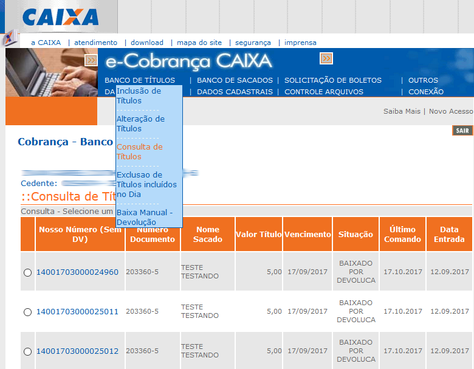

# Cobrança registrada da Caixa Econômica Federal

Webservice de acesso às operações básicas de consulta, inclusão e alteração
de cobranças registradas segundo o [manual fornecido pela CEF](doc/MO38239.pdf).
Existem algumas divergências devido às frequentes modificações no serviço pela
CEF, mas encontra-se funcional e estável na data de publicação deste código.

Trata-se de uma implementação genérica. Regras específicas devem
ser implementadas à parte como é o caso do método `GeraBoleto`.

Compatível com PHP 5.1+

## Modo de uso

1. O atendimento técnico da Caixa Econômica deve fornecer a você os seguintes
   arquivos para serem colocados na pasta `xml`:

    * `Consulta_Cobranca_Bancaria_Boleto.wsdl`
    * `Consulta_Cobranca_Bancaria_Boleto.xsd`
    * `EmiteBoleto.xsd`
    * `Manutencao_Cobranca_Bancaria_Externo.wsdl`
    * `Manutencao_Cobranca_Bancaria_Boleto_Externo.xsd`
    * `MensagensBarramento.xsd`

   Se você não os tiver, é possível baixar as versões de desenvolvimento e modificar os
   caminhos dos arquivos para apontar para os caminhos locais.

```bash
cd xml

curl -sk "https://des.barramento.caixa.gov.br/sibar/ConsultaCobrancaBancaria/Boleto?wsdl" -o "Consulta_Cobranca_Bancaria_Boleto.wsdl"
curl -sk "https://des.barramento.caixa.gov.br/sibar/ConsultaCobrancaBancaria/Boleto?xsd=xsd0" -o "Consulta_Cobranca_Bancaria_Boleto0.xsd"
curl -sk "https://des.barramento.caixa.gov.br/sibar/ConsultaCobrancaBancaria/Boleto?xsd=xsd1" -o "Consulta_Cobranca_Bancaria_Boleto1.xsd"
curl -sk "https://des.barramento.caixa.gov.br/sibar/ManutencaoCobrancaBancaria/Boleto?wsdl" -o "Manutencao_Cobranca_Bancaria_Externo.wsdl"
curl -sk "https://des.barramento.caixa.gov.br/sibar/ManutencaoCobrancaBancaria/Boleto?xsd=xsd0" -o "Manutencao_Cobranca_Bancaria_Boleto_Externo0.xsd"
curl -sk "https://des.barramento.caixa.gov.br/sibar/ManutencaoCobrancaBancaria/Boleto?xsd=xsd1" -o "Manutencao_Cobranca_Bancaria_Boleto_Externo1.xsd"
curl -sk "https://des.barramento.caixa.gov.br/sibar/ManutencaoCobrancaBancaria/Boleto?xsd=xsd2" -o "Manutencao_Cobranca_Bancaria_Boleto_Externo2.xsd"

for i in *; do
    sed -i 's,https://des.barramento.caixa.gov.br/sibar/ConsultaCobrancaBancaria/Boleto?wsdl,Consulta_Cobranca_Bancaria_Boleto.wsdl,g' $i
    sed -i 's,https://des.barramento.caixa.gov.br/sibar/ConsultaCobrancaBancaria/Boleto?xsd=xsd0,Consulta_Cobranca_Bancaria_Boleto0.xsd,g' $i
    sed -i 's,https://des.barramento.caixa.gov.br/sibar/ConsultaCobrancaBancaria/Boleto?xsd=xsd1,Consulta_Cobranca_Bancaria_Boleto1.xsd,g' $i
    sed -i 's,https://des.barramento.caixa.gov.br/sibar/ManutencaoCobrancaBancaria/Boleto?wsdl,Manutencao_Cobranca_Bancaria_Externo.wsdl,g' $i
    sed -i 's,https://des.barramento.caixa.gov.br/sibar/ManutencaoCobrancaBancaria/Boleto?xsd=xsd0,Manutencao_Cobranca_Bancaria_Boleto_Externo0.xsd,g' $i
    sed -i 's,https://des.barramento.caixa.gov.br/sibar/ManutencaoCobrancaBancaria/Boleto?xsd=xsd1,Manutencao_Cobranca_Bancaria_Boleto_Externo1.xsd,g' $i
    sed -i 's,https://des.barramento.caixa.gov.br/sibar/ManutencaoCobrancaBancaria/Boleto?xsd=xsd2,Manutencao_Cobranca_Bancaria_Boleto_Externo2.xsd,g' $i
done
```

   Se for utilizar para produção, modifique também o endereço do barramento de
   requisições dos arquivos WSDL:
   
```bash
sed -i 's,https://des.barramento.caixa.gov.br/sibar/ConsultaCobrancaBancaria/Boleto,https://barramento.caixa.gov.br/sibar/ConsultaCobrancaBancaria/Boleto,g' Consulta_Cobranca_Bancaria_Boleto.wsdl
sed -i 's,https://des.barramento.caixa.gov.br/sibar/ManutencaoCobrancaBancaria/Boleto,https://barramento.caixa.gov.br/sibar/ManutencaoCobrancaBancaria/Boleto,g' Manutencao_Cobranca_Bancaria_Externo.wsdl
```

2. Modifique as constantes definidas no início do arquivo
   `WebserviceCaixa.php`.
   
```php
define('CEDENTE', 'NOME DO CEDENTE');
define('IDENTIFICACAO', 'IDENTIFICACAO DO CEDENTE NO CABECALHO');
define('CNPJ', '999999999999999');
define('ENDERECO1', 'PRIMEIRA LINHA DE ENDERECO');
define('ENDERECO2', 'SEGUNDA LINHA DE ENDERECO');
define('UNIDADE', '9999');
define('HASH_DEBUG', 'HASH SECRETO PARA DEBUG');
```

3. Revise os métodos `Consulta`, `Inclui` e `Altera` para verificar quais
   parâmetros devem ser fornecidos. Para a relação completa de opções, consulte
   o [manual da Caixa Econômica Federal](doc/MO38239.pdf).

```php
include('./WebServiceCaixa/WebserviceCaixa.php');
$parametros = array(
    'CODIGO_BENEFICIARIO' => '951955',
    'NOSSO_NUMERO' => '1947658325871322',
    'NUMERO_DOCUMENTO' => '674389152',
    'DATA_VENCIMENTO' => '2017-10-18',
    'VALOR' => '81.53',
    'FLAG_ACEITE' => 'N',
    'DATA_EMISSAO' => '2017-10-18'
    'NUMERO_DIAS' =>  '30'
    'PAGADOR' => array(
        'CPF' => '0036893461927'
        'NOME' => 'CARLOS FERNANDO ROSA'
        'ENDERECO' => array(
            'LOGRADOURO' => 'ROD ADMAR GONZAGA, 1823',
            'BAIRRO' => 'ITACORUBI',
            'CIDADE' => 'FLORIANOPOLIS',
            'UF' => 'SC'
            'CEP' => '88034000'
    ),
    'FICHA_COMPENSACAO' => array(
        'MENSAGENS' => array(
            'MENSAGEM1' => 'PRIMEIRA LINHA DA MENSAGEM',
            'MENSAGEM2' => 'SEGUNDA LINHA DA MENSAGEM'
        )
    )
);
$ws = new WebserviceCaixa($parametros);
$ws->Gera();
```

## Depuração

Todas as tentativas de transação com o WebService e seus conteúdos podem
ser verificados ao adicionar a variável GET `DEBUG` igual à constante
[`HASH_DEBUG`](https://github.com/vmassuchetto/WebserviceCaixa/blob/a8c2335725d91e004b2f210dd15249770b4f0bd4/WebserviceCaixa.php#L33) na URL:

    http://seusite.com/seuscript.php?DEBUG=8a7478ca4d29abecb82118cc089fc7c057b0d0872a34d0ee1400b2076258f67

## Consulta de títulos

Você pode conferir se as operações do WebService estão corretas usando
o sistema [e-Cobrança](doc/ecobranca-consulta-titulos.png) da Caixa.
Acesse ""Banco de títulos > Consulta de títulos", deixe o formulário em
branco e clique em "Consultar" para exibir todos os títulos.



## Mensagens de erro

Os erros de retorno são verborrágicos, mas podem oferecer informações úteis
sobre os problemas de uma requisição. Geralmente a informação relevante fica
no final da mensagem. Tem que inspecionar com paciência.

```soap
      <soapenv:Envelope xmlns:soapenv="http://schemas.xmlsoap.org/soap/envelope/">
        [...]
        <soapenv:Body>
        [..]
        <DADOS>
        <EXCECAO>
          EXCECAO NO BAR_MANUTENCAO_COBRANCA_BANCARIA_WS.SOAPInput_Empresas_Externas.
          DETALHES:
            ParserException(1) - Funcao: ImbDataFlowNode::createExceptionList,
            Texto Excecao: Node throwing exception, Texto de Insercao
            (1) - BAR_MANUTENCAO_COBRANCA_BANCARIA_WS.SOAPInput_Empresas_Externas.ParserException
            (2) - Funcao: ImbSOAPInputNode::validateData, Texto Excecao: Error occurred in ImbSOAPInputHelper::validateSOAPInput(), Texto de Insercao(1) - BAR_MANUTENCAO_COBRANCA_BANCARIA_WS.SOAPInput_Empresas_Externas.ParserException
            (3) - Funcao: ImbRootParser::parseNextItem, Texto Excecao: Exception whilst parsing.ParserException
            (4) - Funcao: ImbSOAPParser::createSoapShapedTree, Texto Excecao: problem creating SOAP tree from bitstream.ParserException
            (5) - Funcao: ImbXMLNSCParser::parseLastChild, Texto Excecao: XML Parsing Errors have occurred.ParserException
            (6) - Funcao: ImbXMLNSCDocHandler::handleParseErrors, Texto Excecao: A schema validation error has occurred while parsing the XML document, Texto de Insercao
              (1) - 6012, Texto de Insercao
              (2) - 1, Texto de Insercao
              (3) - 28, Texto de Insercao
              (4) - 43, Texto de Insercao
aqui --->     (5) - cvc-enumeration-valid: The value " ISENTO" is not valid with respect to the enumeration facet for type "#Anonymous". It must be a value from the enumeration., Texto de Insercao
              (6) - /XMLNSC/{http://schemas.xmlsoap.org/soap/envelope/}:Envelope/{http://schemas.xmlsoap.org/soap/envelope/}:Body/{http://caixa.gov.br/sibar/manutencao_cobranca_bancaria/boleto/externo}:SERVICO_ENTRADA/DADOS/INCLUI_BOLETO/TITULO/JUROS_MORA/TIPO.
              [...]
```

Neste exemplo, o valor `" ISENTO"` possui um espaço à frente e não é opção
de valor para este campo:

    The value " ISENTO" is not valid with respect to the enumeration facet for type "#Anonymous"

Outros casos como campos chave não preenchidos, caracteres especiais e
tipos inválidos são usualmente reportados nesta estrutura.

## Códigos de erro comuns

Tentando complementar as informações do [manual](doc/MO38239.pdf) (pág. 34)
sobre os códigos de erro mais comuns:

**(X5) TRANSAÇÃO TEMPORARIAMENTE INDISPONÍVEL**

O sistema da Caixa está indisponível. Isto já ocorreu algumas vezes e deve
ocorrer novamente sem nenhum tipo de aviso prévio. Se você entrar em contato
com o HelpDesk eles podem dizer que está tudo bem e que o serviço está
operante, mas obviamente não está. O melhor a fazer infelizmente é aguardar.

**(X5) USUARIO NAO AUTORIZADO A EXECUTAR A TRANSACAO**

Quando tem algum algum erro na geração do hash de autenticação, ou a Caixa
ainda não liberou o CPF ou CNPJ para acesso ao WebService. Verifique no manual
se as variáveis `CODIGO_BENEFICIARIO` e `NOSSO_NUMERO` estão corretas e com o
tamanho correto. Tente também ligar no atendimento da Caixa e perguntar se estes
códigos estão liberados. Alguns casos são resolvidos somente com o Gerente
da conta.

**(47) NOSSO NUMERO NAO CADASTRADO PARA O BENEFICIARIO**

O cálculo do hash de autenticação está correto, mas o `NOSSO_NUMERO` consultado
não consta no convênio informado.

## Geração de boletos

### PDF gerado pela Caixa

O retorno do webservice contém um URL para um PDF que pode ser utilizado,
embora nem sempre ele esteja disponível. Nossa experiência com este
serviço é de forte instabilidade.

```html
<a href="<?php echo $ws->GetUrlBoleto($boleto) ?>">Link para o boleto</a>
```

```php
header('Location:' . $ws->GetUrlBoleto($boleto));
exit();
```

### BoletoPHP

Recomenda-se gerar o seu próprio boleto após a realização das operações usando
o [BoletoPHP](https://github.com/CobreGratis/boletophp), por exemplo:

```php
$dias_de_prazo_para_pagamento = floor((strtotime($ws->GetDataVencimento()) - time()) / 60 * 60 * 24);
$taxa_boleto = 0;
$data_venc = date('d/m/Y', strtotime($ws->GetDataVencimento()));

$nn = $ws->GetNossoNumero();

$dadosboleto["nosso_numero_const1"] = substr($nn, 0, 1);
$dadosboleto["nosso_numero_const2"] = substr($nn, 1, 1);
$dadosboleto["nosso_numero1"] = substr($nn, 2, 3);
$dadosboleto["nosso_numero2"] = substr($nn, 5, 3);
$dadosboleto["nosso_numero3"] = substr($nn, 8, 9);

$valor_cobrado = $ws->GetValor();
$valor_boleto = number_format($valor_cobrado+$taxa_boleto, 2, ',', '');
$dadosboleto["numero_documento"] = $ws->GetNumeroDocumento();
$dadosboleto["data_vencimento"] = date('d/m/Y', strtotime($ws->GetDataVencimento()));
$dadosboleto["data_documento"] = date('d/m/Y', strtotime($ws->GetDataEmissao()));
$dadosboleto["data_processamento"] = date('d/m/Y', strtotime($ws->GetDataEmissao()));
$dadosboleto["valor_boleto"] = $valor_boleto;

$dadosboleto["sacado"] = $ws->GetPagadorNome();
$dadosboleto["endereco1"] = $ws->GetPagadorLogradouro() . ' - ' . $ws->GetPagadorBairro();
$dadosboleto["endereco2"] = $ws->GetPagadorCidade() . ' - ' . $ws->GetPagadorUf() . ' CEP: ' . $ws->GetPagadorCep();

$dadosboleto["demonstrativo1"] = $ws->GetMensagem1();
$dadosboleto["demonstrativo2"] = $ws->GetMensagem2();
$dadosboleto["demonstrativo3"] = '';

$dadosboleto["instrucoes1"] = $ws->GetMensagem1();
$dadosboleto["instrucoes2"] = $ws->GetMensagem2();
$dadosboleto["instrucoes3"] = '';
$dadosboleto["instrucoes4"] = '';

$dadosboleto["quantidade"] = "";
$dadosboleto["valor_unitario"] = "";
$dadosboleto["aceite"] = $ws->GetFlagAceite();
$dadosboleto["especie"] = "R$";
$dadosboleto["especie_doc"] = "";

$dadosboleto["agencia"] = $ws->GetUnidade();
$dadosboleto["conta"] = $ws->GetCodigoBeneficiario();
$dadosboleto["conta_dv"] = '0';

$dadosboleto["conta_cedente"] = $ws->GetCodigoBeneficiario();
$dadosboleto["carteira"] = 'RG';

$cnpj = $ws->GetCnpj();
$dadosboleto["identificacao"] = $ws->GetIdentificacao();
$dadosboleto["cpf_cnpj"] = substr($cnpj, 1, 2) . '.' . substr($cnpj, 3, 3) . '.' . substr($cnpj, 6, 3) . '/' . substr($cnpj, 9, 4) . '-' . substr($cnpj, 13, 2);
$dadosboleto["endereco"] = $ws->GetEndereco1();
$dadosboleto["cidade_uf"] = $ws->GetEndereco2();
$dadosboleto["cedente"] = $ws->GetCedente();

include('./boletophp/funcoes_cef_sigcb.php');
include('./boletophp/layout_cef.php');

if ($ws->dev)
    $ws->ExibeErro('Consulta realizada');

exit();
```
